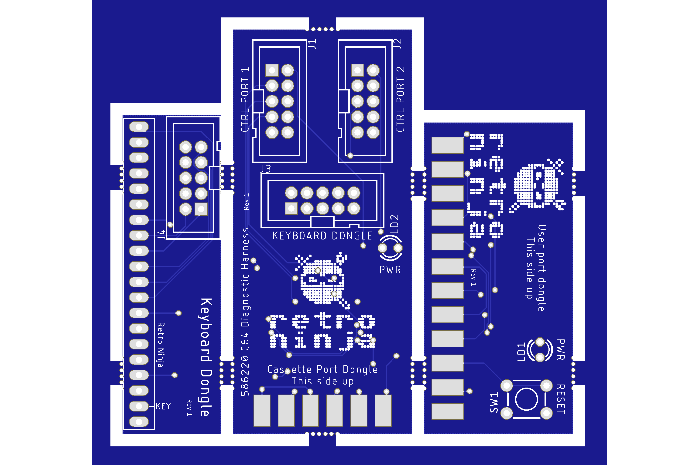
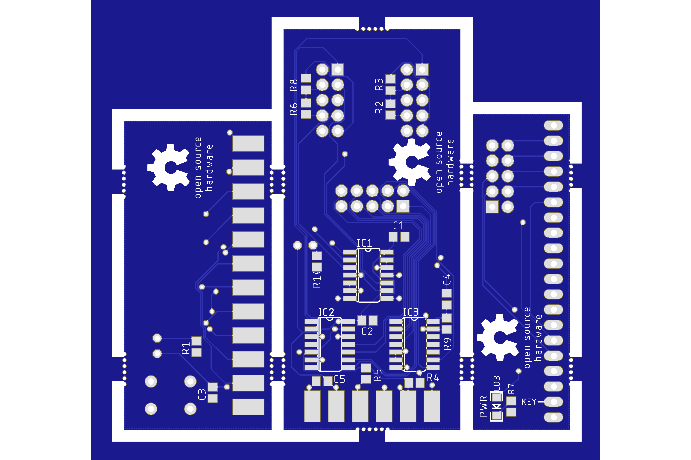
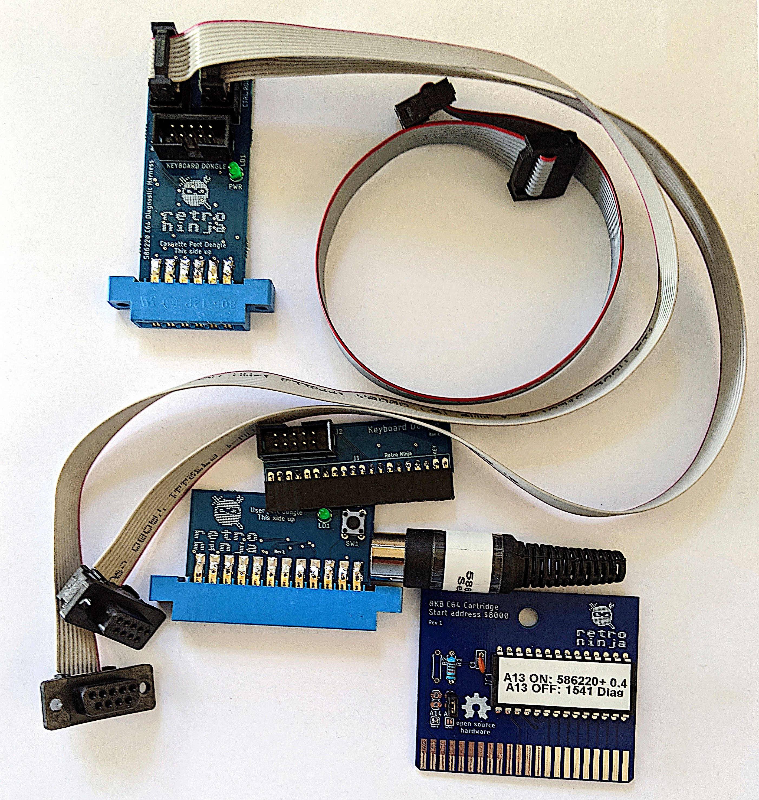

# Retro Ninja 586220 C64 Diagnostic Harness

Eagle schematics and boards plus a combined panel of the three different boards for a C64 586220 diagnostic harmess.

This version is based on the work of [Peter Schepers](https://ist.uwaterloo.ca/~schepers/diagnostic.html) and [Sven Petersen](https://github.com/svenpetersen1965/C64-Diagnostic-Rev.-586220-Harness).
The reason I made this version was to make the boards smaller so that all three boards can fit on one PCB panel and thereby reducing the cost of the PCB by two thirds when using the 10x10cm prototype offers from PCB houses like Seeed Studio.
Making a panel also has the advantage that you can order a paste stencil with the PCB panel which makes it very easy to solder the SMD components for all three boards at once which is good if you want to build a batch of boards.

 

The program cartridge needed for the diagnostic program is a standard 8 Kilobyte cartridge running from $8000.
I will make schematics and gerbers for the cartridge available in a separate repository later.
ROM images for the cartridge can be found at [worldofjani.com](http://blog.worldofjani.com/?p=164).

A DIN connector loopback adapter is also required for testing the serial port. Connect pin 1 to pin 5 and connect pin 3 to pin 4.

## BOM for Cassette Port
| Component | Pcs | Name | Comment |
 |:--------|---:|:---|:------|
 | C1,C2,C3,C4 | 4 | 100nF ceramic 0805 | |
 | CN1 | 1 | 12-pin (2x6) female edge connector | 3.96mm pitch |
 | IC1,IC2,IC3 | 3 | CD4066B SOIC-14 | Quad Bilateral Switch |
 | J1,J2,J3 | 3 | 10-pin IDC male | Shrouded connector recommended |
 | LD1 | 1 | LED 3mm | Power LED |
 | R1,R2,R5,R6 | 4 | 110K 0805 | 120k works too |
 | R3,R9 | 2 | 330R 0805 | R9=current limiter for LED, 560R or even higher should be ok for R9 |
 | R4 | 1 | 150R 0805 | |
 
## BOM for User Port
 | Component | Pcs | Name | Comment |
 |:--------|---:|:---|:------|
 | C3 | 1 | 100nF ceramic 0805| |
 | LD1 | 1 | LED 3mm | Power LED |
 | R1 | 1 | 330R 0805 | Current limiter for LED. 560R or even higher should be ok |
 | SW1 | 1 | Tactile Switch 6x6mm | |
 | X1 | 1 | 24-pin (2x12) female edge connector | 3.96mm pitch |
 
## BOM for Keyboard
 | Component | Pcs | Name | Comment |
 |:--------|---:|:---|:------|
 | J1 | 1 | 20pin female header right angle|2,54mm pitch |
 | J2 | 1 | 10-pin IDC male|shrouded connector recommended |
 | LD1 | 1 | LED 1206 | Power LED |
 | R1 | 1 | 330R | Current limiter for LED. 560R or even higher should be ok |
 
## Cables
### Control port cable (2 pcs) ###
9-pin female D-SUB with IDC connection in one end and a 10-pin female IDC plug in the other end.
For each control port you need a 9 or 10 pin ribbon cable that is at least 45cm after connectors have been installed.

### Keyboard cable ###
10-pin ribbon cable with 10-pin female IDC plug on each end.

## Serial port ##
6-pin male DIN connector

Retro Ninja
